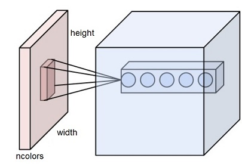

# Converting TFLEARN model to Keras

Hello everyone, today we are going to learn how to translate a simple neural network made in TFLEARN to Keras

The neural network that I want to translate to **Keras** from **TFLEARN** is the following:


```python
from utils import nparameters_convolution, roundeven #Helper functions for this blog
def alexnet_adapted(width, height, lr, output=29):
    # Building 'AlexNet'                                                               #line  Type Layer   Operation
    network = input_data(shape=[None, width, height, 3])                               #0
    network = conv_2d(network, filters1, kernel1, stride1, activation='relu')          #1    CONV1         1
    network = max_pool_2d(network, kernel2, strides=stride2 )                          #2    POOL1         2
    network = local_response_normalization(network)                                    #3    
    network = conv_2d(network, filters3 , kernel3 , activation='relu')                 #4    CONV2         3
    network = max_pool_2d(network, kernel4, strides=stride4)                           #5    POOL2         4
    network = local_response_normalization(network)                                    #6
    network = conv_2d(network, filters5 , kernel5 , activation='relu')                 #7    CONV3         5
    network = conv_2d(network, filters6 , kernel6 , activation='relu')                 #8    CONV4         6
    network = conv_2d(network, filters7, kernel7 , activation='relu')                  #9    CONV5         7
    network = max_pool_2d(network, kernel8 , strides=stride8 )                         #10   POOL3         8
    network = local_response_normalization(network)                                    #11   
    network = fully_connected(network, activation9, activation='relu')                 #12    FC1          9
    network = dropout(network, dropout13)                                              #13
    network = fully_connected(network, activation10, activation='relu')                #14    FC2          10
    network = dropout(network, dropout15)                                              #15
    network = fully_connected(network, outputs11, activation='softmax')                #16    FC3          11
    network = regression(network, optimizer='momentum',                                #17
                         loss='categorical_crossentropy',
                         learning_rate=learning_rate17)

    # Training
    model = tflearn.DNN(network, checkpoint_path='alexnet',
                        max_checkpoints=1, tensorboard_verbose=2, tensorboard_dir='log')

    return model
```

with the following set of parameter


```python
#Normalization Parameter
Norma        = 29/1000
#Paramters                          Operation Type Layer
filters1     =  roundeven(96*Norma)   #1        CONV1
kernel1      =  11       
stride1      =  4
kernel2      =  3                     #2        POOL1
stride2      =  2
filters3     =  roundeven(256*Norma)  #3        CONV2
kernel3      =  5
kernel4      =  3                     #4        POOL2
stride4      =  2
filters5     =  roundeven(384*Norma)  #5        CONV3
kernel5      =  3
filters6     =  roundeven(384*Norma)  #6        CONV4
kernel6      =  3
filters7     =  roundeven(256*Norma)  #7        CONV5
kernel7      =  3
kernel8      =  3                      #8       POOL3
stride8      =  2 
activation9  =  roundeven(4096*Norma)  #9       FC1
activation10 =  roundeven(4096*Norma)  #10      FC2
outputs11    =  int(1000*Norma)   #11           FC3

dropout13=0.5
dropout15=0.5
learning_rate17=0.001
```

This is the adapted version of the Alexnet Network to the **MMORPG-AI** problem

## Step 1  Analysis of the architecture of the network

What we have to pay attention is  the architecture  and the dimensions of each layer.
The network mentioned before contains three types of layers in a convolution:

- Convolution (CONV)
- Pooling (POOL)
- Fully connected (FC)


What we have to do is define the  network using **Keras library**. 
The parameters of the network will be kept according to the above descriptions, 

- 5 convolutional layers with kernel size 
- 3 fully connected layers,with different  activation function at all layers except at the output layer. 

Since we will test this model **MMORPG- AI** problem 
at the output layer we will define a Dense layer with **29 nodes**.

The model that we want to translate is simply a modified version of the AlexNet Network. From the previous parametrization we can determine the values of the **activation shape**, **activation size** and **number of parameters**, as was described in my previous blog.

```
Operation, Activation Shape, Activation Size, #Parameters
0 (270, 480, 3)
1 ((65, 118, 96), 736320, 34944)
2 ((32, 58, 96), 178176, 0)
3 ((32, 58, 256), 475136, 614656)
4 ((15, 28, 256), 107520, 0)
5 ((15, 28, 384), 161280, 885120)
6 ((15, 28, 384), 161280, 1327488)
7 ((15, 28, 256), 107520, 884992)
8 ((7, 13, 256), 23296, 0)
9 ((4096, 1), 4096, 95424512)
10 ((4096, 1), 4096, 16781312)
11 ((29, 1), 29, 118813)
```

Having in mind those numbers it is more simple perform the translation from one to another neural network formalism.

## Step 2  - Importing library for Keras


```python
#Importing library
import keras
from keras.models import Sequential
from keras.layers import Dense, Activation, Dropout, Flatten, Conv2D, MaxPooling2D
import numpy as np
from tensorflow.keras.layers import BatchNormalization
```

## Step 3 Determination the layers 
We define the size of the pictures


```python
width= 480
height= 270
ncolors=3
```

We instantiation the network in Keras like 


```python
np.random.seed(1000)
#Instantiation
AlexNet = Sequential()
```

In ordering to "translate" from one framework to another we need know only three types of layers in Keras.

### 1st Convolutional Layer

The input layer that we will consider in this project cooresponds to an image with the following  dimensions **(270, 480, 3)** or simply by (width, height, ncolors),   with  kernel **11 x 11** and  stride 4 without padding and 4 filters.


Each neuron in the convolutional layer is connected only to a local region in the input volume spatially, but to the full depth (i.e. all color channels).



 The  Conv2D parameter, filters determines the number of kernels to convolve with the input volume. Each of these operations produces a 2D activation map.
 
A Conv2D layer outputs n feature maps, which is the number of kernels or filters, and the channels dimension is always equal to the number of output feature maps. 

The Keras Conv2D layer, given a multi-channel input , will apply the filter across ALL the color channels and sum the results, producing the equivalent of a monochrome convolved output image. 

Let us consider our input image file
with this dimension (270, 480, 3)


```python
inputs  = height, width, ncolors #nw x nh x nc image
kernel  = 11,11    #fw x fw  filter
stride  = 4.0      #stride s
padding = 5        #padding p
filters = 4        #number of filters ncl
newinput=nparameters_convolution(inputs, kernel,stride,padding,filters)
newinput
```

    Activation Shape, Activation Size, # Parameters
    


    ((68, 120, 4), 32640, 1456)


Where in TFELEARN the 1st Convolutional Layer called CONV1 corresponds to

```
network = conv_2d(network, 4, 11, 4, activation='relu')          #1    CONV1         1
```
Where the first arguments in Tflearn are

```
tflearn.layers.conv.conv_2d (
incoming,
nb_filter,
filter_size,
strides=1,
padding='same'
)
```

Arguments
- incoming: Tensor. Incoming 4-D Tensor.
- nb_filter: int. The number of convolutional filters.
- filter_size: int or list of int. Size of filters.
- strides: 'intor list ofint`. Strides of conv operation. Default: [1 1 1 1].
- padding: str from "same", "valid". Padding algo to use. Default: 'same'.

Meanwhile in keras the first Arguments of the Conv2D class are the following

```
Conv2D class
tf.keras.layers.Conv2D(
    filters,
    kernel_size,
    strides=(1, 1),
    padding="valid",
)
```

Arguments

- filters: Integer, the dimensionality of the output space (i.e. the number of output filters in the convolution).
- kernel_size: An integer or tuple/list of 2 integers, specifying the height and width of the 2D convolution window. 
- strides: An integer or tuple/list of 2 integers, specifying the strides of the convolution along the height and width. 
- padding: one of "valid" or "same" (case-insensitive). "valid" means no padding. "same" results in padding with zeros evenly to the left/right or up/down of the input. When padding="same" and strides=1, the output has the same size as the input.

then in the Keras this is given by


```python
AlexNet.add(Conv2D(filters=4, input_shape=(270, 480, 3), kernel_size=(11,11), strides=(4,4), padding='same'))
```

This layer creates a convolution kernel that is convolved with the layer input to produce a tensor of outputs.  On the first layer we learn a total of 4 filters. 


```python
AlexNet.add(BatchNormalization())
AlexNet.add(Activation('relu'))
```

The calculation of the dimensions used in nparameters_convolution adapted to keras may be computed as:


```python
def conv2d_keras(input_length,stride ,filter_size,padding):
    if padding == 'same':   # for tf.layers.conv2d` with `same` padding
        output_length = input_length
    elif padding == 'valid':   # for tf.layers.conv2d` with `valid` padding
        output_length = input_length - filter_size 
    return (output_length + stride - 1) // stride
```


```python
out_height = conv2d_keras(height ,stride1,filters1,'same')
out_width  = conv2d_keras(width ,stride1,filters1,'same')
out_height,out_width,filters1
```


    (68, 120, 4)


```python
#Model Summary
AlexNet.summary()
```

    Model: "sequential"
    _________________________________________________________________
     Layer (type)                Output Shape              Param #   
    =================================================================
     conv2d (Conv2D)             (None, 68, 120, 4)        1456      
                                                                     
     batch_normalization (BatchN  (None, 68, 120, 4)       16        
     ormalization)                                                   
                                                                     
     activation (Activation)     (None, 68, 120, 4)        0         
                                                                     
    =================================================================
    Total params: 1,472
    Trainable params: 1,464
    Non-trainable params: 8
    _________________________________________________________________
    

From the previous summary we can see that the Total of parameters are 1456, which is the same of  # Parameters.


Max pooling is then used to reduce the spatial dimensions of the output volume.

In TFLEARN the the next part
```
    network = max_pool_2d(network, kernel2, strides=stride2 )                          #2    POOL1         2
    network = local_response_normalization(network)                                    #3    
```


in Keras may be written as


```python
AlexNet.add(MaxPooling2D(pool_size=(kernel2,kernel2), strides=(stride2,stride2), padding='same'))
```


```python
#Model Summary
AlexNet.summary()
```

    Model: "sequential"
    _________________________________________________________________
     Layer (type)                Output Shape              Param #   
    =================================================================
     conv2d (Conv2D)             (None, 68, 120, 4)        1456      
                                                                     
     batch_normalization (BatchN  (None, 68, 120, 4)       16        
     ormalization)                                                   
                                                                     
     activation (Activation)     (None, 68, 120, 4)        0         
                                                                     
     max_pooling2d (MaxPooling2D  (None, 34, 60, 4)        0         
     )                                                               
                                                                     
    =================================================================
    Total params: 1,472
    Trainable params: 1,464
    Non-trainable params: 8
    _________________________________________________________________
    

In keras you have two types of Conv2d, with valid padding and same.


- valid : only ever drops the right-most columns (or bottom-most rows).
There's no "made-up" padding inputs. The layer only uses valid input data.

- same  tries to pad evenly left and right, but if the amount of columns to be added is odd, it will add the extra column to the right.

If you use a stride of 1, the layer's outputs will have the same spatial dimensions as its inputs


### 2nd Convolutional Layer

In TFLEARN
```
    network = conv_2d(network, filters3 , kernel3 , activation='relu')                 #4    CONV2         3
```
and in Keras is


```python
AlexNet.add(Conv2D(filters=filters3, kernel_size=(kernel3, kernel3), strides=(1,1), padding='same'))
AlexNet.add(BatchNormalization())
AlexNet.add(Activation('relu'))
```

In TFELARN
```
    network = max_pool_2d(network, kernel4, strides=stride4)                           #5    POOL2         4
    network = local_response_normalization(network)                                    #6
```
becomes in Keras


```python
AlexNet.add(MaxPooling2D(pool_size=(kernel4,kernel4), strides=(stride4,stride4), padding='same'))
```

### 3rd Convolutional Layer

In TFLEARN
```
   network = conv_2d(network, filters5 , kernel5 , activation='relu')                 #7    CONV3         5
```
becomes in Keras


```python
#3rd Convolutional Layer
AlexNet.add(Conv2D(filters=filters5, kernel_size=(kernel5,kernel5), strides=(1,1), padding='same'))
AlexNet.add(BatchNormalization())
AlexNet.add(Activation('relu'))
```

### 4th Convolutional Layer

In TFLEARN
```
  network = conv_2d(network, filters6 , kernel6 , activation='relu')                 #8    CONV4         6
```
becomes in Keras


```python
#4th Convolutional Layer
AlexNet.add(Conv2D(filters=filters6, kernel_size=( kernel6, kernel6), strides=(1,1), padding='same'))
AlexNet.add(BatchNormalization())
AlexNet.add(Activation('relu'))
```

### 5th Convolutional Layer

In TFLEARN
```
  network = conv_2d(network, filters7, kernel7 , activation='relu')                  #9    CONV5         7
```  
becomes in Keras


```python
#5th Convolutional Layer
AlexNet.add(Conv2D(filters=filters7, kernel_size=(kernel7,kernel7), strides=(1,1), padding='same'))
AlexNet.add(BatchNormalization())
AlexNet.add(Activation('relu'))
```

In TFLEARN
```
    network = max_pool_2d(network, kernel8 , strides=stride8 )                         #10   POOL3         8
    network = local_response_normalization(network)                                    #11   
```
becomes in Keras


```python
AlexNet.add(MaxPooling2D(pool_size=(kernel8,kernel8), strides=(stride8,stride8), padding='same'))
```

###  1st Fully Connected Layer

In TFLEARN
```
    network = fully_connected(network, activation9, activation='tanh')                 #12    FC1          9
    network = dropout(network, dropout13)                                              #13
```
first we need to passing it to a Fully Connected layer


```python
#Passing it to a Fully Connected layer
AlexNet.add(Flatten())
```

then write the connected layer


```python
# 1st Fully Connected Layer
AlexNet.add(Dense(activation9, input_shape=(270, 480, 3,)))
AlexNet.add(BatchNormalization())
AlexNet.add(Activation('relu'))
# Add Dropout to prevent overfitting
AlexNet.add(Dropout(dropout13))
```

### 2nd Fully Connected Layer

In TFLEARN
```
    network = fully_connected(network, activation10, activation='tanh')                #14    FC2          10
    network = dropout(network, dropout15)                                              #15
```
becomes in Keras


```python
#2nd Fully Connected Layer
AlexNet.add(Dense(activation10))
AlexNet.add(BatchNormalization())
AlexNet.add(Activation('relu'))
#Add Dropout
AlexNet.add(Dropout(dropout15))
```

### 3rd Fully Connected Layer and Output Layer

In TFLEARN
```
    network = fully_connected(network, outputs11, activation='softmax')                #16    FC3          11
    network = regression(network, optimizer='momentum',                                #17
                     loss='categorical_crossentropy',
                     learning_rate=learning_rate17)
```
becomes


```python
#3rd Fully Connected Layer
AlexNet.add(Dense(1000))
AlexNet.add(BatchNormalization())
AlexNet.add(Activation('relu'))
#Add Dropout
AlexNet.add(Dropout(dropout15))
#Output Layer
AlexNet.add(Dense(outputs11))
AlexNet.add(BatchNormalization())
AlexNet.add(Activation('softmax'))
```


```python
#Model Summary
AlexNet.summary()
```

    Model: "sequential"
    _________________________________________________________________
     Layer (type)                Output Shape              Param #   
    =================================================================
     conv2d (Conv2D)             (None, 68, 120, 4)        1456      
                                                                     
     batch_normalization (BatchN  (None, 68, 120, 4)       16        
     ormalization)                                                   
                                                                     
     activation (Activation)     (None, 68, 120, 4)        0         
                                                                     
     max_pooling2d (MaxPooling2D  (None, 34, 60, 4)        0         
     )                                                               
                                                                     
     conv2d_1 (Conv2D)           (None, 34, 60, 8)         808       
                                                                     
     batch_normalization_1 (Batc  (None, 34, 60, 8)        32        
     hNormalization)                                                 
                                                                     
     activation_1 (Activation)   (None, 34, 60, 8)         0         
                                                                     
     max_pooling2d_1 (MaxPooling  (None, 17, 30, 8)        0         
     2D)                                                             
                                                                     
     conv2d_2 (Conv2D)           (None, 17, 30, 12)        876       
                                                                     
     batch_normalization_2 (Batc  (None, 17, 30, 12)       48        
     hNormalization)                                                 
                                                                     
     activation_2 (Activation)   (None, 17, 30, 12)        0         
                                                                     
     conv2d_3 (Conv2D)           (None, 17, 30, 12)        1308      
                                                                     
     batch_normalization_3 (Batc  (None, 17, 30, 12)       48        
     hNormalization)                                                 
                                                                     
     activation_3 (Activation)   (None, 17, 30, 12)        0         
                                                                     
     conv2d_4 (Conv2D)           (None, 17, 30, 8)         872       
                                                                     
     batch_normalization_4 (Batc  (None, 17, 30, 8)        32        
     hNormalization)                                                 
                                                                     
     activation_4 (Activation)   (None, 17, 30, 8)         0         
                                                                     
     max_pooling2d_2 (MaxPooling  (None, 9, 15, 8)         0         
     2D)                                                             
                                                                     
     flatten (Flatten)           (None, 1080)              0         
                                                                     
     dense (Dense)               (None, 120)               129720    
                                                                     
     batch_normalization_5 (Batc  (None, 120)              480       
     hNormalization)                                                 
                                                                     
     activation_5 (Activation)   (None, 120)               0         
                                                                     
     dropout (Dropout)           (None, 120)               0         
                                                                     
     dense_1 (Dense)             (None, 120)               14520     
                                                                     
     batch_normalization_6 (Batc  (None, 120)              480       
     hNormalization)                                                 
                                                                     
     activation_6 (Activation)   (None, 120)               0         
                                                                     
     dropout_1 (Dropout)         (None, 120)               0         
                                                                     
     dense_2 (Dense)             (None, 1000)              121000    
                                                                     
     batch_normalization_7 (Batc  (None, 1000)             4000      
     hNormalization)                                                 
                                                                     
     activation_7 (Activation)   (None, 1000)              0         
                                                                     
     dropout_2 (Dropout)         (None, 1000)              0         
                                                                     
     dense_3 (Dense)             (None, 29)                29029     
                                                                     
     batch_normalization_8 (Batc  (None, 29)               116       
     hNormalization)                                                 
                                                                     
     activation_8 (Activation)   (None, 29)                0         
                                                                     
    =================================================================
    Total params: 304,841
    Trainable params: 302,215
    Non-trainable params: 2,626
    _________________________________________________________________
    


```python
from IPython.display import display_html
def restartkernel() :
    display_html("<script>Jupyter.notebook.kernel.restart()</script>",raw=True)

```


```python
restartkernel()
```


<script>Jupyter.notebook.kernel.restart()</script>


# FULL CODE 1 Translated


```python
#Helper functions for this blog
from utils import nparameters_convolution, roundeven
#Importing library
import keras
from keras.models import Sequential
from keras.layers import Dense, Activation, Dropout, Flatten, Conv2D, MaxPooling2D
import numpy as np
from tensorflow.keras.layers import BatchNormalization


#We define the parameters
width= 480
height= 270
ncolors=3
#Normalization Parameter
Norma        = 29/1000
#Paramters                          Operation 
filters1     =  roundeven(96*Norma)   #1
kernel1      =  11       
stride1      =  4
kernel2      =  3                     #2
stride2      =  2
filters3     =  roundeven(256*Norma)  #3
kernel3      =  5
kernel4      =  3                     #4
stride4      =  2
filters5     =  roundeven(384*Norma)  #5
kernel5      =  3
filters6     =  roundeven(384*Norma)  #6
kernel6      =  3
filters7     =  roundeven(256*Norma)  #7
kernel7      =  3
kernel8      =  3                      #8
stride8      =  2 
activation9  =  roundeven(4096*Norma)  #9
activation10 =  roundeven(4096*Norma)  #10
outputs11    =  int(1000*Norma)   #11

dropout13=0.5
dropout15=0.5
learning_rate17=0.001


np.random.seed(1000)
#Instantiation
AlexNet = Sequential()
AlexNet.add(Conv2D(filters=filters1, input_shape=(height, width, ncolors), kernel_size=(11,11), strides=(stride1,stride1), padding='same'))
AlexNet.add(BatchNormalization())
AlexNet.add(Activation('relu'))
AlexNet.add(MaxPooling2D(pool_size=(kernel2,kernel2), strides=(stride2,stride2), padding='same'))
AlexNet.add(Conv2D(filters=filters3, kernel_size=(kernel3, kernel3), padding='same'))
AlexNet.add(BatchNormalization())
AlexNet.add(Activation('relu'))
AlexNet.add(MaxPooling2D(pool_size=(kernel4,kernel4), strides=(stride4,stride4), padding='same'))
#3rd Convolutional Layer
AlexNet.add(Conv2D(filters=filters5, kernel_size=(kernel5,kernel5), padding='same'))
AlexNet.add(BatchNormalization())
AlexNet.add(Activation('relu'))
#4th Convolutional Layer
AlexNet.add(Conv2D(filters=filters6, kernel_size=( kernel6, kernel6), padding='same'))
AlexNet.add(BatchNormalization())
AlexNet.add(Activation('relu'))
#5th Convolutional Layer
AlexNet.add(Conv2D(filters=filters7, kernel_size=(kernel7,kernel7),  padding='same'))
AlexNet.add(BatchNormalization())
AlexNet.add(Activation('relu'))
AlexNet.add(MaxPooling2D(pool_size=(kernel8,kernel8), strides=(stride8,stride8), padding='same'))
#Passing it to a Fully Connected layer
AlexNet.add(Flatten())
# 1st Fully Connected Layer
AlexNet.add(Dense(activation9, input_shape=(270, 480, 3,)))
AlexNet.add(BatchNormalization())
AlexNet.add(Activation('relu'))
# Add Dropout to prevent overfitting
AlexNet.add(Dropout(dropout13))
#2nd Fully Connected Layer
AlexNet.add(Dense(activation10))
AlexNet.add(BatchNormalization())
AlexNet.add(Activation('relu'))
#Add Dropout
AlexNet.add(Dropout(dropout15))
#3rd Fully Connected Layer
AlexNet.add(Dense(1000))
AlexNet.add(BatchNormalization())
AlexNet.add(Activation('relu'))
#Add Dropout
AlexNet.add(Dropout(dropout15))
#Output Layer
AlexNet.add(Dense(outputs11))
AlexNet.add(BatchNormalization())
AlexNet.add(Activation('softmax'))

#Model Summary
AlexNet.summary()
```

    Model: "sequential"
    _________________________________________________________________
     Layer (type)                Output Shape              Param #   
    =================================================================
     conv2d (Conv2D)             (None, 68, 120, 4)        1456      
                                                                     
     batch_normalization (BatchN  (None, 68, 120, 4)       16        
     ormalization)                                                   
                                                                     
     activation (Activation)     (None, 68, 120, 4)        0         
                                                                     
     max_pooling2d (MaxPooling2D  (None, 34, 60, 4)        0         
     )                                                               
                                                                     
     conv2d_1 (Conv2D)           (None, 34, 60, 8)         808       
                                                                     
     batch_normalization_1 (Batc  (None, 34, 60, 8)        32        
     hNormalization)                                                 
                                                                     
     activation_1 (Activation)   (None, 34, 60, 8)         0         
                                                                     
     max_pooling2d_1 (MaxPooling  (None, 17, 30, 8)        0         
     2D)                                                             
                                                                     
     conv2d_2 (Conv2D)           (None, 17, 30, 12)        876       
                                                                     
     batch_normalization_2 (Batc  (None, 17, 30, 12)       48        
     hNormalization)                                                 
                                                                     
     activation_2 (Activation)   (None, 17, 30, 12)        0         
                                                                     
     conv2d_3 (Conv2D)           (None, 17, 30, 12)        1308      
                                                                     
     batch_normalization_3 (Batc  (None, 17, 30, 12)       48        
     hNormalization)                                                 
                                                                     
     activation_3 (Activation)   (None, 17, 30, 12)        0         
                                                                     
     conv2d_4 (Conv2D)           (None, 17, 30, 8)         872       
                                                                     
     batch_normalization_4 (Batc  (None, 17, 30, 8)        32        
     hNormalization)                                                 
                                                                     
     activation_4 (Activation)   (None, 17, 30, 8)         0         
                                                                     
     max_pooling2d_2 (MaxPooling  (None, 9, 15, 8)         0         
     2D)                                                             
                                                                     
     flatten (Flatten)           (None, 1080)              0         
                                                                     
     dense (Dense)               (None, 120)               129720    
                                                                     
     batch_normalization_5 (Batc  (None, 120)              480       
     hNormalization)                                                 
                                                                     
     activation_5 (Activation)   (None, 120)               0         
                                                                     
     dropout (Dropout)           (None, 120)               0         
                                                                     
     dense_1 (Dense)             (None, 120)               14520     
                                                                     
     batch_normalization_6 (Batc  (None, 120)              480       
     hNormalization)                                                 
                                                                     
     activation_6 (Activation)   (None, 120)               0         
                                                                     
     dropout_1 (Dropout)         (None, 120)               0         
                                                                     
     dense_2 (Dense)             (None, 1000)              121000    
                                                                     
     batch_normalization_7 (Batc  (None, 1000)             4000      
     hNormalization)                                                 
                                                                     
     activation_7 (Activation)   (None, 1000)              0         
                                                                     
     dropout_2 (Dropout)         (None, 1000)              0         
                                                                     
     dense_3 (Dense)             (None, 29)                29029     
                                                                     
     batch_normalization_8 (Batc  (None, 29)               116       
     hNormalization)                                                 
                                                                     
     activation_8 (Activation)   (None, 29)                0         
                                                                     
    =================================================================
    Total params: 304,841
    Trainable params: 302,215
    Non-trainable params: 2,626
    _________________________________________________________________
    
